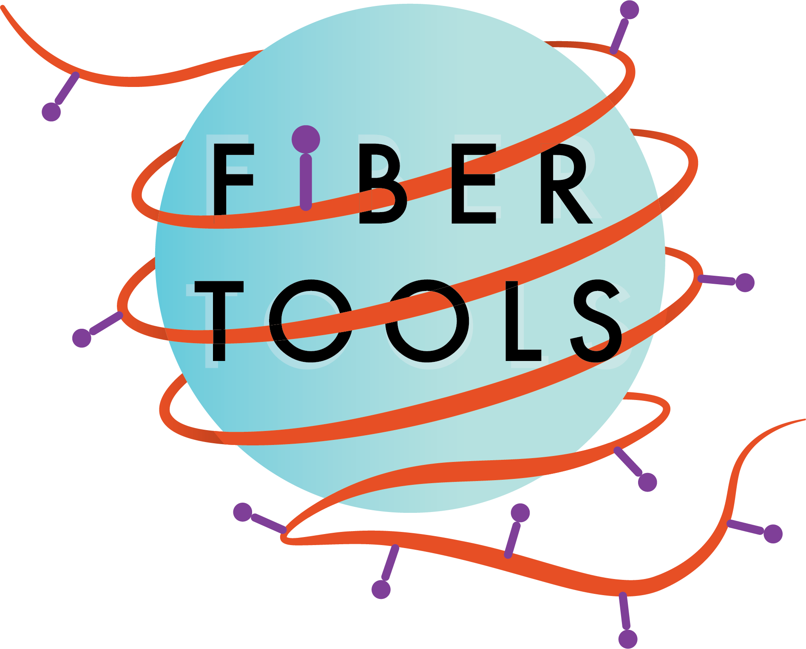

This is the book for the computational tools of [Fiber-seq](glossary.md#fiber-seq) which describes the two major software tools:
1) `fibertools` (`ft`) which is a CLI tool for **creating and interacting with Fiber-seq BAM** files. 
    * the `samtools` of [Fiber-seq](glossary.md#fiber-seq)
2) [**<ins>F</ins>iber-seq <ins>I</ins>nferred <ins>R</ins>egulatory <ins>E</ins>lements**](fire/fire.md) which is a method for identifying regulatory elements on individual [fibers](glossary.md#fiber-seq-read-or-fiber) and peak calling.
    * the `MACS2` of [Fiber-seq](glossary.md#fiber-seq)

Some **Key features** include:
* [Predicting m6A](creatings/predict.md) sites from PacBio Fiber-seq data
* [Identifying FIREs](creating/fire.md) (**<ins>F</ins>iber-seq <ins>I</ins>nferred <ins>R</ins>egulatory <ins>E</ins>lements**)
* [Extracting](extracting/extract.md) Fiber-seq results into plain text files.
* [Centering](extracting/center.md) Fiber-seq results around a given position.
* [pyft](pyft.md): Python bindings for `fibertools`

A quick start guide can be found [here](quick-start.md).

