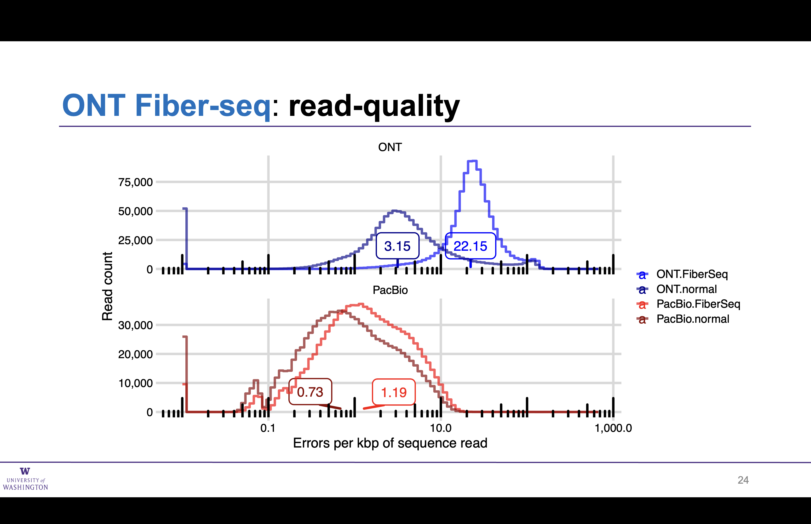
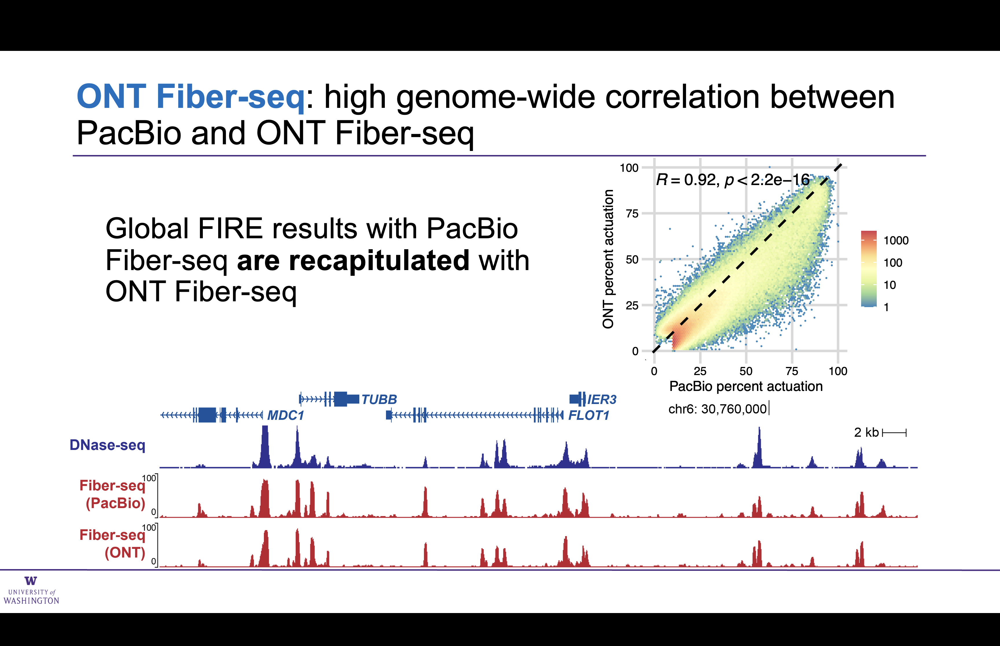
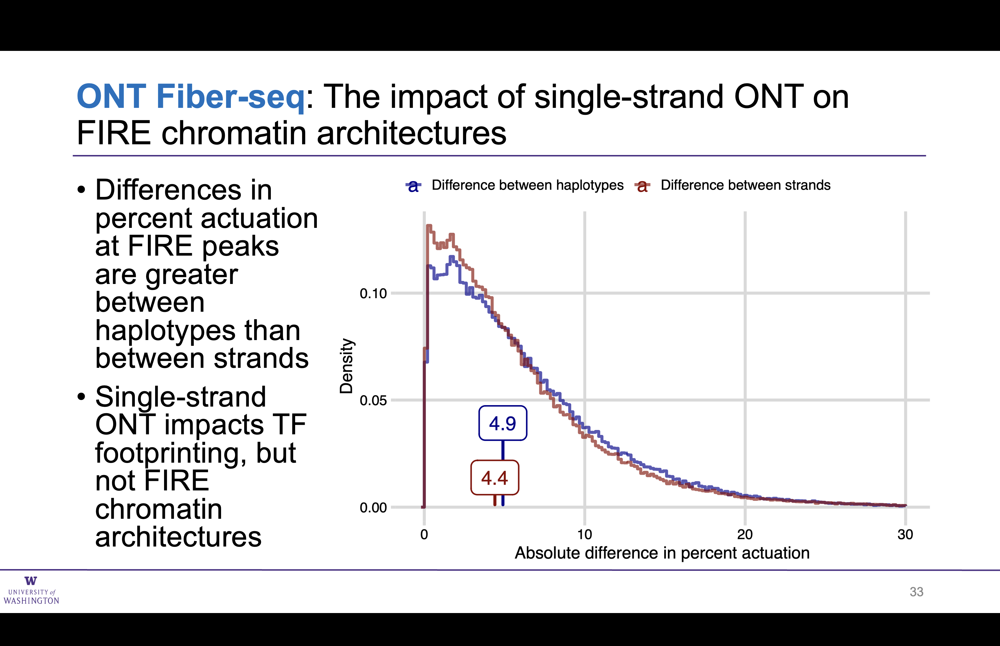
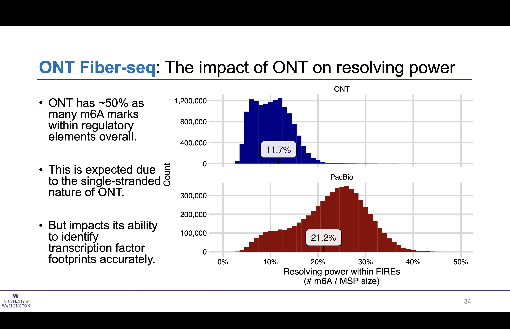
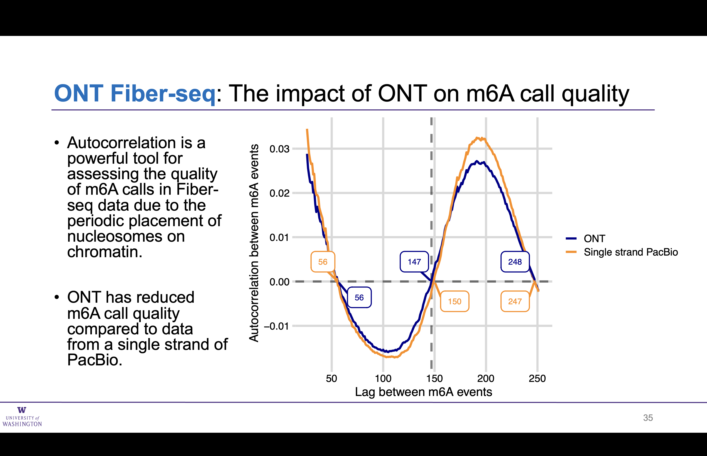

# ONT Fiber-seq Analysis

## Matched ONT and PacBio preparations

## Read lengths unchanged by Fiber-seq

## Impact of Fiber-seq on ONT read quality 

## A comparison of ONT and PacBio Fiber-seq

## Genome-wide comparison of ONT and PacBio Fiber-seq

## Transcription factor foot printing has reduced resolution with ONT

## Stand does not significantly impact ONT Fiber-seq FIRE results

## ONT FIREs have ~half as many m6A sites as PacBio (as expected)

## Auto-correlation of m6A sites in ONT nearly matches a single strand of PacBio

## Overall conclusions

