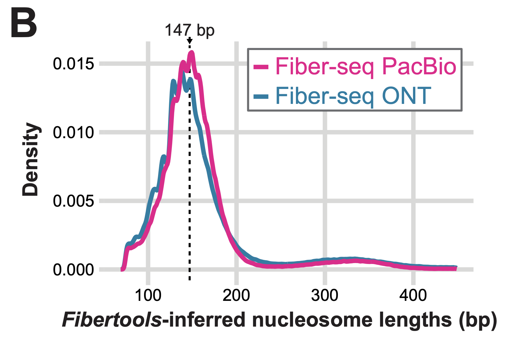

# `ft add-nucleosomes`

`ft add-nucleosomes` adds nucleosome positions and MSP positions to the Fiber-seq bam. The input is a Fiber-seq bam file with m6A calls and the output is a Fiber-seq bam file with the nucleosome positions encoded in the `ns` and `nl` tags and the MSP positions encoded in the `as` and `al` tags.

It is usually unnecessary to run this command manually, as it is called by `ft predict-m6a` automatically. However, you can run it manually if you want to adjust the parameters of the nucleosome calling algorithm.

[**The help page**](../help.md#ft-add-nucleosomes)

## Methods

Nucleosome calling is performed by identifying stretches of DNA that are protected from Hia5 and therefore do not have m6A signal. We have found the false positives in nucleosomes are very low when using `fibertools` (Jha et al.) allowing for a heuristic to perform as well as or better than our previous HMM caller (Dubocanin et al.).

There are three parameters in our heuristic nucleosome calling that can be adjusted: the minimum nucleosome length (`n`, default 75), the minimum combined nucleosome length (`c`, default 100), and the minimum extension to nucleosome length (`e`, default 25). These three parameters impact the three phases in nucleosome calling.

- Call all regions that have no m6A events for at least `n` bases a candidate nucleosome.
- Call all regions of size `c` or more that have only one internal m6A (putative false positive) a candidate nucleosome.
- Extend the length of nucleosomes identified in phases one and two if by spanning one additional m6A `e` bases of unmodified sequence would be added to the nucleosome length.

